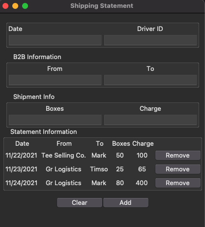

# Tkinter GUI to Web Visual

## Purpose

This app is intended for a shipping/logistics business to log transaction statements and create an invoice that is exported to Json, with the option to view via React on the web.

## App Feature Check list

_subject to change\*_

- Python Tkinter GUI
- Web Representation via HTML and/or PDF file
  - Use React to create output via JSON
- CRUD capabilities
- export to PDF

## Tkinter App

## Goals for self

I want to create this project in hopes of developing and honing in my programming skills across different programming languages, skills, and habits. In this project I will be working on :

- Python (related libraries)
- Sytem File Paths
- UX/UI
- Github
- Clean and documented code
- Markup
- Json
